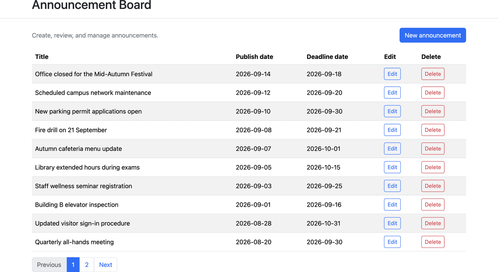
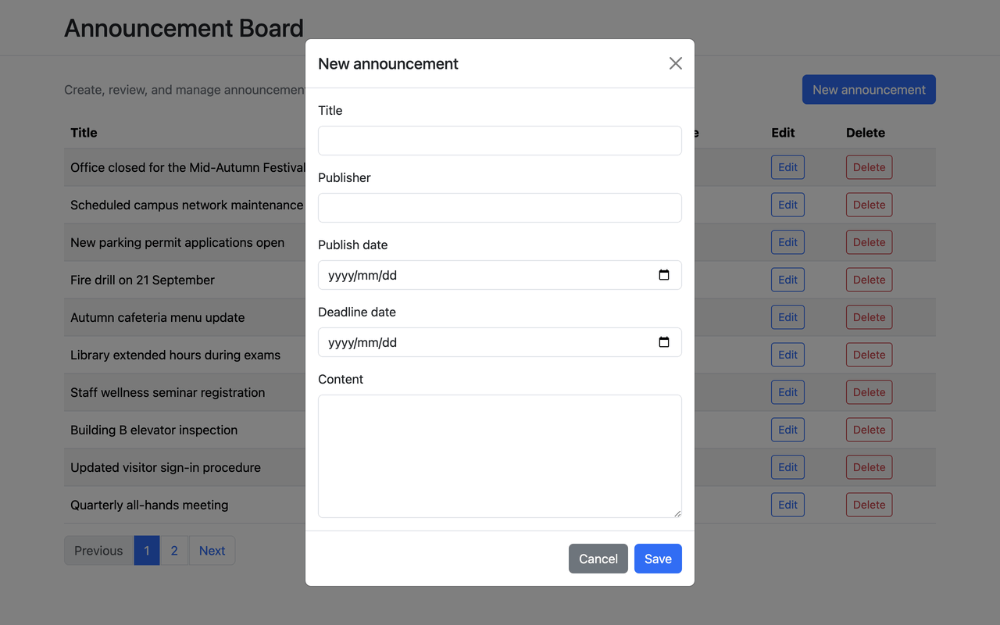
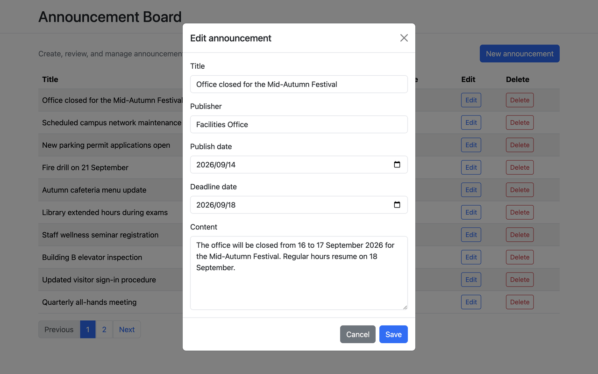
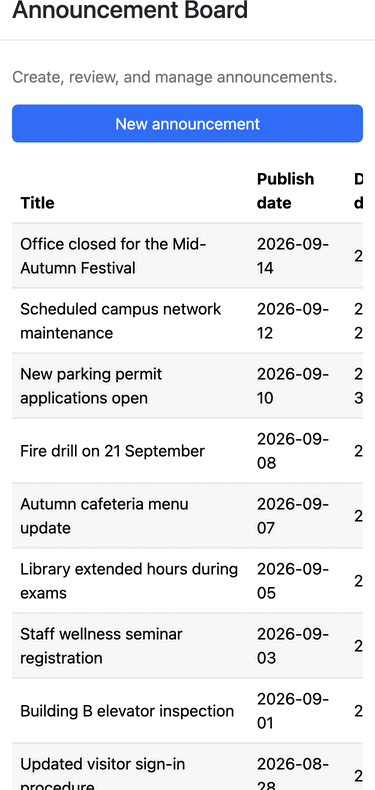

# Intumit Announcement Board

A homework-sized announcement board: Spring MVC, Spring Data JPA/Hibernate, MySQL, and a Bootstrap/jQuery frontend, packaged as a WAR for external Tomcat.

The required assignment scope is complete. When deployed as documented, the UI is available at `/announcement-board/` and the REST API at `/announcement-board/api/announcements`. Acceptance evidence is in [`docs/ACCEPTANCE.md`](docs/ACCEPTANCE.md). CentOS setup and deployment are documented in [`docs/DEPLOYMENT.md`](docs/DEPLOYMENT.md).

Design notes: [`docs/PROJECT_PLAN.md`](docs/PROJECT_PLAN.md). CentOS setup and Tomcat runbook: [`docs/DEPLOYMENT.md`](docs/DEPLOYMENT.md).

## Features

- Announcement list showing title, publish date, and deadline date
- Server-side pagination (10 items per page, newest publish date first)
- Create, edit, and delete through a Bootstrap UI
- Fields: title, publisher, publish date, deadline date, content
- Bean Validation on the API, with matching client-side checks
- Flyway-managed MySQL schema; Hibernate validates and does not migrate
- Packaged WAR deployed to system Tomcat 10.1

The application has **no authentication**. Keep it on a trusted private network unless access control is added in a separate reviewed change.

## Technology stack

| Component | Version | Notes |
| --- | --- | --- |
| OpenJDK | 21 (AppStream `java-21-openjdk-devel`) | Runtime on CentOS |
| Maven compiler target | Java 17 | Keeps the WAR portable |
| Spring Boot | 3.5.16 | Current supported 3.5.x release, compatible with Tomcat 10.1 |
| Tomcat | 10.1 (CentOS AppStream package) | External container; Tomcat is `provided` in the WAR |
| MySQL | 8.4 LTS Community Server | Official MySQL EL10 repository, not Innovation/9.x |
| Flyway | Managed by Spring Boot 3.5.16 | `flyway-core` plus `flyway-mysql` |
| Bootstrap | 5.3.8 | Pinned CDN with SRI |
| jQuery | 3.7.1 | Pinned CDN with SRI |

Spring Boot 4 and Tomcat 11 were not used because CentOS Stream 10 ships Tomcat 10.1. Docker and Docker Compose are not used.

## Database configuration

Database credentials are **not** stored in Git. On the VM they live in mode `600` files:

- `/etc/announcement-board.env` (read by the Tomcat systemd unit)
- `~/.config/announcement-board/env` (used for Maven builds/tests; point it to an isolated test database)

See [`.env.example`](.env.example) for the required variable names and non-secret placeholders:

- `DB_URL`
- `DB_USERNAME`
- `DB_PASSWORD`

**Never run the Maven test suite against the production database.** The tests use the installed MySQL server and assume that the `announcements` table starts empty. Existing production rows affect count, ordering, and pagination assertions. Use `announcement_board_test` for `~/.config/announcement-board/env`; reserve `announcement_board` for `/etc/announcement-board.env` and the deployed application.

Load the variables before Maven with the helper (it does not print secrets):

```bash
python3 scripts/with-db-env ./mvnw -B clean test
python3 scripts/with-db-env ./mvnw -B clean package
```

MySQL listens only on `127.0.0.1`. Port 3306 is not opened in the firewall.

Flyway owns schema creation. The initial migration is [`src/main/resources/db/migration/V1__create_announcements.sql`](src/main/resources/db/migration/V1__create_announcements.sql). It creates the `announcements` table, a `CHECK` constraint requiring `deadline_date >= publish_date`, and an index on `(publish_date DESC, id DESC)`.

Hibernate is configured with `spring.jpa.hibernate.ddl-auto=validate`. It maps the `Announcement` entity and refuses to start if the database does not match; it does not create or update tables. Do not add `schema.sql` or `data.sql` alongside Flyway.

SQL logging is **disabled by default**. Enable it only while debugging:

```bash
JPA_SHOW_SQL=true JPA_FORMAT_SQL=true python3 scripts/with-db-env ./mvnw -B test
```

After tests or a Tomcat deploy, inspect non-secret schema metadata without printing credentials:

```bash
python3 scripts/describe-schema
```

That helper reports table names, Flyway version and success state, `SHOW CREATE TABLE announcements`, character set/collation, and the `announcements` row count. Repository and API tests roll back inserted rows, so the isolated test database should remain empty except for Flyway metadata.

## Build and test

On the CentOS VM:

```bash
python3 scripts/with-db-env ./mvnw -B clean test
python3 scripts/with-db-env ./mvnw -B clean package
```

The packaged artifact is `target/announcement-board.war`.

## Local and remote development workflow

1. SSH to the CentOS VM and fast-forward the checkout.
2. Change application code on the working branch.
3. Run `python3 scripts/with-db-env ./mvnw -B test`.
4. Package the WAR, then deploy it with `python3 scripts/deploy-centos`.
5. Open the UI through the SSH tunnel described below.

Do not run the application on a workstation against a separate local database. The authoritative environment is the VM.

## External Tomcat deployment

On the CentOS Tomcat host:

```bash
python3 scripts/with-db-env ./mvnw -B clean package
python3 scripts/deploy-centos
```

The deployment helper uses the existing `target/announcement-board.war`. It backs up the installed WAR outside `webapps`, stops Tomcat, replaces the WAR and exploded application directory, starts Tomcat, and waits for the application URL to return HTTP 200. It does not build, run the smoke test, validate service configuration or network listeners, or roll back automatically. On startup Flyway applies pending migrations, then Hibernate validates the schema. Full install and manual rollback steps are in [`docs/DEPLOYMENT.md`](docs/DEPLOYMENT.md).

This helper causes a short Tomcat outage. It is appropriate for the homework VM and other private single-node hosts. It is not a zero-downtime procedure.

## UI and API URLs

On the VM, or on a workstation through the tunnel:

| What | URL |
| --- | --- |
| UI | `http://127.0.0.1:8080/announcement-board/` |
| UI (localhost alias) | `http://localhost:8080/announcement-board/` |
| CSS | `http://127.0.0.1:8080/announcement-board/css/app.css` |
| JavaScript | `http://127.0.0.1:8080/announcement-board/js/app.js` |
| List API | `http://127.0.0.1:8080/announcement-board/api/announcements?page=0&size=10` |

## SSH tunnel for local browser access

Tomcat's HTTP port stays on the VM loopback during development. Do not open port 8080 in the firewall. Forward it from your workstation instead:

```bash
ssh -i "<ssh-key-path>" -o IdentitiesOnly=yes \
  -N -L 8080:127.0.0.1:8080 \
  "<ssh-user>@<centos-host>"
```

Then open:

```text
http://127.0.0.1:8080/announcement-board/
http://localhost:8080/announcement-board/
```

That URL is the live board: the page loads announcements from MySQL through the REST API.

## REST API

Base path (external Tomcat context included): `/announcement-board/api/announcements`.

Controllers map `/api/announcements`. Tomcat adds the `/announcement-board` context from the WAR name.

| Method | Path | Success | Purpose |
| --- | --- | --- | --- |
| `GET` | `/api/announcements?page=0&size=10` | `200` | One server-side page, sorted by `publishDate DESC`, then `id DESC` |
| `GET` | `/api/announcements/{id}` | `200` | One announcement for editing |
| `POST` | `/api/announcements` | `201` | Create an announcement |
| `PUT` | `/api/announcements/{id}` | `200` | Replace all editable fields |
| `DELETE` | `/api/announcements/{id}` | `204` | Delete an announcement |

Query parameters: `page` is zero-based and defaults to `0`. `size` defaults to `10` and must be between `1` and `100`. Client-controlled sorting is not accepted.

Request body fields: `title`, `publisher`, `publishDate`, `deadlineDate`, `content`. All are required. `title` max 200 characters, `publisher` max 100 characters, and `deadlineDate` must be on or after `publishDate`.

Response body fields: `id`, `title`, `publisher`, `publishDate`, `deadlineDate`, `content`. Persistence timestamps are not exposed.

Example create request:

```json
{
  "title": "System maintenance",
  "publisher": "Administrator",
  "publishDate": "2026-09-11",
  "deadlineDate": "2026-09-18",
  "content": "The service will be unavailable."
}
```

Example list response:

```json
{
  "items": [
    {
      "id": 12,
      "title": "System maintenance",
      "publisher": "Administrator",
      "publishDate": "2026-09-11",
      "deadlineDate": "2026-09-18",
      "content": "The service will be unavailable."
    }
  ],
  "page": 0,
  "size": 10,
  "totalItems": 21,
  "totalPages": 3
}
```

The `id` value above is illustrative. The database assigns IDs; do not treat example IDs as permanent data.

Example error response:

```json
{
  "message": "Validation failed",
  "fieldErrors": {
    "title": "Title is required"
  }
}
```

### Remote curl examples

These assume an SSH tunnel or a shell on the VM. They do not use database credentials.

```bash
BASE=http://127.0.0.1:8080/announcement-board/api/announcements

curl -sS "$BASE"

CREATED=$(curl -sS -X POST "$BASE" \
  -H 'Content-Type: application/json' \
  -d '{
    "title": "System maintenance",
    "publisher": "Administrator",
    "publishDate": "2026-09-11",
    "deadlineDate": "2026-09-18",
    "content": "The service will be unavailable."
  }')
ID=$(printf '%s' "$CREATED" | python3 -c 'import json,sys; print(json.load(sys.stdin)["id"])')

curl -sS "$BASE/$ID"

curl -sS -X PUT "$BASE/$ID" \
  -H 'Content-Type: application/json' \
  -d '{
    "title": "Updated maintenance",
    "publisher": "Administrator",
    "publishDate": "2026-09-11",
    "deadlineDate": "2026-09-19",
    "content": "The window was extended."
  }'

curl -sS "$BASE?page=0&size=1"

curl -sS -D - -X POST "$BASE" \
  -H 'Content-Type: application/json' \
  -d '{"title":""}'

curl -sS -D - "$BASE/999999999"

curl -sS -D - -X DELETE "$BASE/$ID"
```

`ID` comes from the create response. Delete smoke-test records when you are done.

## Validation behavior

Validation failures and invalid `page`/`size` values return `400`. Missing announcements return `404`. Malformed JSON and invalid dates return `400` with a safe message. Database constraint violations return a safe `400` without SQL or table details. Unexpected errors return a generic `500` and are logged on the server. Error bodies never include stack traces or exception class names.

Client-side checks use the native `required` and `maxlength` attributes, reject whitespace-only title, publisher, and content, reject a deadline before the publish date, and raise the deadline input’s `min` when the publish date changes. The first invalid field receives focus. The backend remains authoritative. Field errors from `fieldErrors` are mapped onto the matching controls. Raw HTML, stack traces, and response bodies are never inserted into the page.

## Frontend UI

The WAR serves a single Bootstrap 5.3.8 page at the application root (`index.html`) with custom assets at `css/app.css` and `js/app.js`. Bootstrap and jQuery 3.7.1 are loaded from pinned CDN URLs with `integrity` and `crossorigin` attributes. Asset paths are relative so the page works under the `/announcement-board` context path.

`app.js` talks to the API with the context-safe relative URL `api/announcements` (no leading slash). A leading slash would drop the Tomcat context and call `/api/announcements` on the host root.

1. On page load, jQuery requests `GET api/announcements?page=0&size=10` and renders title, publish date, deadline date, Edit, and Delete. Content is not shown in the list.
2. **New announcement** opens the shared modal, resets the form, and `POST`s JSON when the form is valid.
3. **Edit** loads the current record with `GET api/announcements/{id}`, fills all five fields, and `PUT`s JSON to that id.
4. **Delete** opens the Bootstrap confirmation modal (not `window.confirm`) and sends `DELETE` only after the danger button is pressed.
5. Pagination uses the API’s `page`, `totalItems`, and `totalPages`. Labels are one-based; requests stay zero-based. Previous is disabled on the first page and Next on the last. Pagination is hidden when there is at most one page. A sliding window of at most five numbered links is used when there are many pages.
6. After a successful create, edit, or delete, the modal closes, a polite success message appears, and the current list page is reloaded. If the only row on a later page is deleted, the previous page is loaded instead.

## Smoke and acceptance tests

After a deploy, run the helpers independently:

```bash
python3 scripts/smoke-test-deployment
python3 scripts/acceptance-test
python3 scripts/acceptance-test http://127.0.0.1:8080/announcement-board
python3 scripts/describe-schema
```

`scripts/smoke-test-deployment` creates one uniquely titled `P6SMOKE-...` row and deletes that id. `scripts/acceptance-test` creates uniquely titled `P7ACCEPT-<token>` records, records their exact IDs, and deletes only those IDs. Neither helper deletes unrelated rows. Both return nonzero if any assertion fails. The evidence report is [`docs/ACCEPTANCE.md`](docs/ACCEPTANCE.md).

## Documentation

- [`docs/PROJECT_PLAN.md`](docs/PROJECT_PLAN.md) — design and required scope
- [`docs/DEPLOYMENT.md`](docs/DEPLOYMENT.md) — clean CentOS setup and Tomcat deployment runbook
- [`docs/ACCEPTANCE.md`](docs/ACCEPTANCE.md) — acceptance evidence

## Screenshots

### Assignment reference screenshots

These images were extracted from the supplied assignment. They show the required information and workflow, not a visual style that must be reproduced exactly.

**Reference list**


**Reference create form**


**Reference edit form**


### Implemented application screenshots

These images were captured from the deployed CentOS Tomcat UI at `http://localhost:8080/announcement-board/` through the SSH tunnel. They show fictional homework data, not production records.

**Implemented list with pagination**



**Implemented create modal**



**Implemented edit modal**



**Implemented narrow layout**



## Non-goals and possible future work

These items are intentionally out of the homework submission. They are not implemented:

- Authentication, roles, and per-user permissions
- Attachment upload and download
- Rich-text editing and HTML sanitization
- Search, filtering, and configurable sorting
- Audit history and soft delete
- Docker, Docker Compose, or Kubernetes
- Turning the private development VM into a public server
