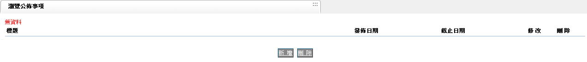
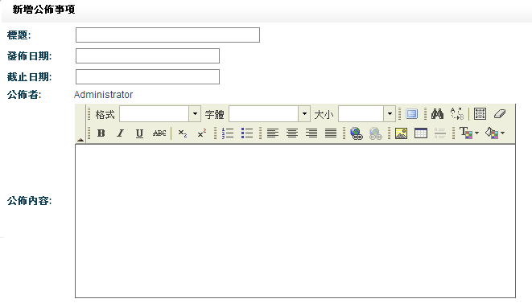
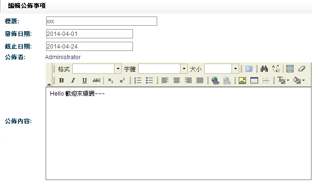

# Announcement Board - Project Plan and Design

**Status:** The required homework scope in this plan is implemented and accepted on the private CentOS development VM. Screenshots and GitHub closeout live in the README. Production-shaped Nginx/TLS guidance for a **separate** host is in [`PRODUCTION_DEPLOYMENT.md`](PRODUCTION_DEPLOYMENT.md). Optional items in section 11 remain out of scope.

## 1. Goal

Build a small web-based announcement board that replaces the desktop/MFC-like screens in the assignment with:

- A Spring MVC backend
- Hibernate persistence through Spring Data JPA
- A MySQL database
- A Bootstrap and jQuery frontend
- Deployment on CentOS with Tomcat

This is intentionally designed as a homework-sized application, not a production content-management system.

## 2. Required Scope

The assignment requires:

1. An announcement list showing title, publish date, and deadline date.
2. Server-side pagination.
3. Create, edit, and delete actions.
4. Announcement fields:
   - Title
   - Publisher
   - Publish date
   - Deadline date
   - Content
5. Source code on GitHub and a deployed website.

Attachment upload is described as optional. It should be implemented only after the core application is complete and deployed.

### Reference UI Screenshots

The following images were extracted from the supplied assignment. They show the required information and workflow, not a visual style that must be reproduced exactly.

**Announcement list**



**Create announcement form**



**Edit announcement form**



## 3. Recommended Technical Design

### 3.1 Architecture

Use one Maven project and deploy one WAR file to Tomcat.

```text
Browser
  Bootstrap page + jQuery AJAX
                |
                | JSON over HTTP
                v
Spring MVC REST controller
                |
                v
Application service
                |
                v
Spring Data JPA repository
                |
                v
Hibernate -> MySQL
```

The frontend remains a real HTTP client of the backend, but is served from the same application. This avoids a separate frontend server, Node/npm build, and CORS configuration.

### 3.2 Technology Choices

- OpenJDK 21 on CentOS Stream 10 (AppStream `java-21-openjdk-devel`)
- Maven compiler target Java 17, so the WAR stays portable
- Spring Boot 3.5.16, the current 3.5.x release compatible with Tomcat 10.1
- CentOS AppStream Tomcat 10.1 as an external container
- Spring Web MVC
- Spring Data JPA with Hibernate as the JPA provider
- Bean Validation
- MySQL Connector/J
- MySQL 8.4 LTS Community Server installed directly on CentOS (official EL10 repository)
- Maven Wrapper 3.9.16
- Bootstrap CSS/components
- jQuery AJAX
- JUnit and Spring Boot Test
- Flyway for versioned schema migrations (`flyway-core` and `flyway-mysql`)

Spring Boot 4 and Tomcat 11 are not used: CentOS Stream 10 provides Tomcat 10.1, and Spring Boot 3.5.x is the matching supported line. Docker and Docker Compose are not part of the development or deployment workflow.

### 3.3 Deployment Shape

- Package as `announcement-board.war`.
- Build, test, and run the application on a CentOS Stream 10 development VM (`<ssh-user>@<centos-host>`).
- Deploy the WAR to the system Tomcat 10.1 service on that VM.
- Serve both `/index.html` and `/api/announcements` from the same WAR.
- Supply database credentials through a mode `600` server-side environment file (`DB_URL`, `DB_USERNAME`, `DB_PASSWORD`) rather than committing passwords.
- Bind MySQL to `127.0.0.1`. Do not open port 3306 in the firewall.
- Keep Tomcat's HTTP port private during development and reach it with an SSH tunnel (`-L 8080:127.0.0.1:8080`).
- Use the context path `/announcement-board` unless the application is deployed as Tomcat's root application.

An executable Spring Boot JAR with embedded Tomcat is simpler operationally, but the WAR approach is the safest interpretation of the assignment's explicit Tomcat requirement.

## 4. Data Model

Only one main table is required.

### `announcements`

| Column | Type | Rules |
| --- | --- | --- |
| `id` | `BIGINT` | Primary key, auto-increment |
| `title` | `VARCHAR(200)` | Required |
| `publisher` | `VARCHAR(100)` | Required |
| `publish_date` | `DATE` | Required |
| `deadline_date` | `DATE` | Required; cannot be before publish date |
| `content` | `TEXT` | Required |
| `created_at` | `DATETIME(6)` | Set by the backend on first persist |
| `updated_at` | `DATETIME(6)` | Set by the backend on persist and every update |

Default list order: `publish_date DESC, id DESC`.

Schema ownership:

- Flyway creates and versions the table with `db/migration/V1__create_announcements.sql`.
- Hibernate uses `spring.jpa.hibernate.ddl-auto=validate`. It must not create or alter tables.
- `created_at` and `updated_at` use `DATETIME(6)` so they match Hibernate's default `LocalDateTime` precision on MySQL 8.
- A `CHECK` constraint enforces `deadline_date >= publish_date`.
- An index on `(publish_date DESC, id DESC)` supports the default list order.
- Do not add `schema.sql` or `data.sql` alongside Flyway.

No user, role, category, history, or attachment table is needed for the minimum submission.

## 5. Backend API

Base path: `/api/announcements`

| Method | Path | Purpose | Success |
| --- | --- | --- | --- |
| `GET` | `?page=0&size=10` | Get one list page | `200` |
| `GET` | `/{id}` | Get one announcement for editing | `200` |
| `POST` | `/` | Create an announcement | `201` |
| `PUT` | `/{id}` | Replace editable announcement fields | `200` |
| `DELETE` | `/{id}` | Delete an announcement | `204` |

Recommended list response:

```json
{
  "items": [
    {
      "id": 12,
      "title": "System maintenance",
      "publisher": "Administrator",
      "publishDate": "2026-09-11",
      "deadlineDate": "2026-09-18",
      "content": "The service will be unavailable..."
    }
  ],
  "page": 0,
  "size": 10,
  "totalItems": 21,
  "totalPages": 3
}
```

Keep error handling small and consistent:

```json
{
  "message": "Validation failed",
  "fieldErrors": {
    "title": "Title is required"
  }
}
```

Use `400` for validation failures and `404` when an announcement does not exist. Do not expose stack traces or database details to the browser.

## 6. Frontend Design

Use a single responsive page.

### Main page

- Page title: "Announcement Board"
- Primary "New announcement" button
- Bootstrap table with:
  - Title
  - Publish date
  - Deadline date
  - Edit button
  - Delete button
- Bootstrap pagination below the table
- Empty-state message when there are no announcements

### Create/edit form

Use one Bootstrap modal for both create and edit. Fields:

- Title: text input
- Publisher: text input
- Publish date: HTML date input
- Deadline date: HTML date input
- Content: textarea

Use a plain textarea rather than a rich-text editor. The reference screenshot contains a rich editor, but the written requirement only asks for announcement content.

### Browser behavior

- jQuery loads the first page on document ready.
- Pagination links request the corresponding backend page.
- Edit loads the current record into the same modal.
- Save submits `POST` or `PUT`, then reloads the current list page.
- Delete requires a Bootstrap confirmation modal.
- A Bootstrap alert or toast reports success and failure.
- Client-side checks improve feedback, but the backend remains responsible for validation.

Keep all custom JavaScript in one `app.js` and custom CSS in one small `app.css`.

## 7. Suggested Project Structure

```text
pom.xml
src/main/java/com/example/announcement/
  AnnouncementApplication.java
  ServletInitializer.java
  controller/AnnouncementController.java
  service/AnnouncementService.java
  repository/AnnouncementRepository.java
  domain/Announcement.java
  dto/AnnouncementRequest.java
  dto/AnnouncementResponse.java
  dto/PageResponse.java
  exception/ApiExceptionHandler.java
src/main/resources/
  application.properties
  application-prod.properties
  db/migration/V1__create_announcements.sql
  static/index.html
  static/js/app.js
  static/css/app.css
src/test/java/com/example/announcement/
  AnnouncementApiTest.java
README.md
```

Do not add interfaces for every class, a generic repository layer, microservices, or a separate JavaScript framework. They add structure without helping this assignment.

## 8. Work Estimate

Estimates are focused engineering hours for someone already comfortable with Spring and basic frontend work.

| Task | Estimate |
| --- | ---: |
| Confirm environment and scaffold Maven/WAR project | 0.5-1 hour |
| MySQL schema, entity, repository, and sample data | 1-1.5 hours |
| CRUD service, REST endpoints, validation, and errors | 2-3 hours |
| Bootstrap table, modal form, pagination, and jQuery AJAX | 2.5-3.5 hours |
| Automated tests and manual browser verification | 1.5-2.5 hours |
| CentOS/Tomcat/MySQL deployment configuration | 1.5-3 hours |
| README, screenshots, cleanup, and GitHub handoff | 1-1.5 hours |
| **Minimum complete submission** | **10-16 hours** |

For a developer learning these tools while building, plan approximately 18-28 hours.

### Optional additions

| Addition | Extra estimate |
| --- | ---: |
| Attachment upload/download with size/type checks | 3-5 hours |
| Rich-text editor and HTML sanitization | 2-4 hours |
| Login and authorization | 5-8 hours |
| HTTPS, DNS, and reverse-proxy setup | 1-3 hours, excluding infrastructure delays |

The estimate assumes SSH access to the CentOS Stream 10 development VM. Java, Tomcat, and MySQL are provisioned on that VM as part of Phase 1; they are not provided by Docker. Waiting for unrelated infrastructure is not included.

## 9. Implementation Order

1. Create the Maven project and production configuration placeholders.
2. Create the database migration and JPA entity.
3. Implement and test CRUD plus pagination through the API.
4. Build the Bootstrap list and modal form.
5. Connect jQuery AJAX and handle error/empty/loading states.
6. Package the WAR on CentOS and smoke-test it on the VM's Tomcat 10.1 service.
7. Keep using the same CentOS VM for later phases and run the acceptance checklist there.
8. Add README instructions and screenshots.
9. Consider attachments only if time remains.

## 10. Acceptance Checklist

- List displays title, publish date, and deadline date.
- Pagination works with more records than the page size.
- A valid announcement can be created and appears in the list.
- An existing announcement can be edited.
- Delete asks for confirmation and removes the record.
- Blank required fields are rejected.
- A deadline before the publish date is rejected.
- Missing records return a clear `404` response.
- Refreshing the browser preserves data in MySQL.
- The layout is usable on desktop and a narrow screen.
- The application runs from the deployed Tomcat URL on CentOS.
- Database passwords and other secrets are absent from GitHub.
- README contains build, database, deployment, and test instructions.

## 11. Deliberate Non-goals

For the initial homework submission, exclude:

- Authentication and role management
- Attachment upload
- Rich-text editing
- Search, filtering, and configurable sorting
- Audit history and soft delete
- Multiple services or a separate frontend deployment
- WebSockets or real-time updates
- Docker, Docker Compose, or Kubernetes

These can be described in the README as future improvements without delaying the required deliverable.
